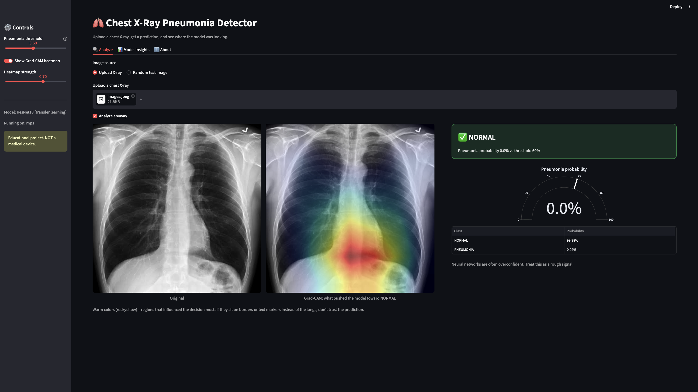
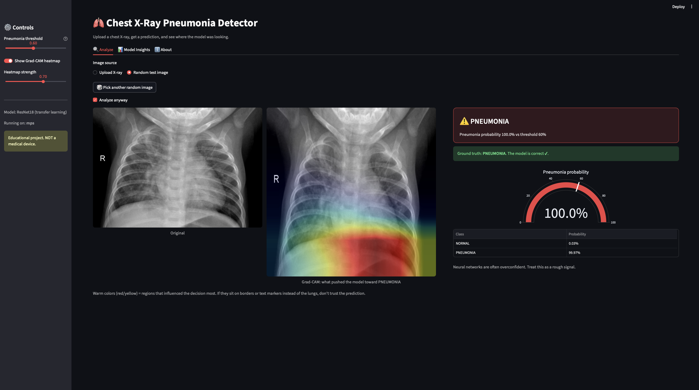
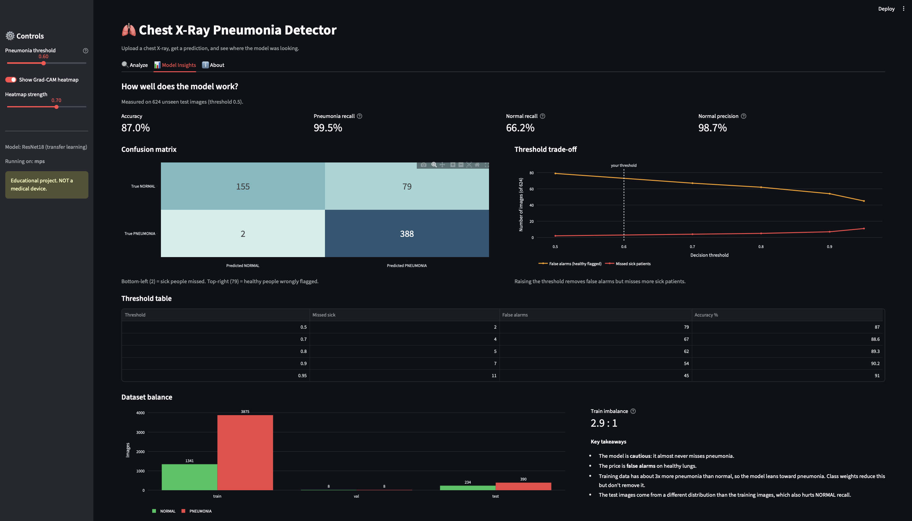

# 🫁 Chest X-Ray Pneumonia Detector

A deep learning project that classifies chest X-rays as **NORMAL** or **PNEUMONIA**, with a Streamlit web dashboard that shows predictions, Grad-CAM heatmaps, and model insights.

> ⚠️ **Educational project only. This is NOT a medical device and must not be used for diagnosis.**

## Features

- **Transfer learning** with a pretrained ResNet18 (PyTorch)
- **GPU training** on Apple Silicon (MPS), with automatic CUDA / CPU fallback
- **Class-weighted loss** to handle the imbalanced dataset
- **Streamlit dashboard** with three tabs:
  - **Analyze**: upload an X-ray or pick a random test image, see a verdict, probability gauge, and Grad-CAM heatmap
  - **Model Insights**: confusion matrix, threshold trade-off, dataset balance
  - **About**: how it works and its limitations
- **Grad-CAM** heatmaps showing which regions influenced the decision
- Adjustable decision threshold
- Warning when an uploaded image does not look like an X-ray

## Dataset

[Chest X-Ray Images (Pneumonia)](https://www.kaggle.com/datasets/paultimothymooney/chest-xray-pneumonia) from Kaggle.

| Split | NORMAL | PNEUMONIA |
|---|---|---|
| Train | 1341 | 3875 |
| Val | 8 | 8 |
| Test | 234 | 390 |

The training set has about 2.9x more pneumonia images than normal ones. The dataset is **not included** in this repo.

## Results

Evaluated on the 624 unseen test images (threshold 0.5):

| Metric | Value |
|---|---|
| Accuracy | 87.0% |
| Pneumonia recall | 99.5% (388 of 390 caught) |
| Normal recall | 66.2% (155 of 234) |
| Normal precision | 98.7% |

Confusion matrix:

| | Predicted NORMAL | Predicted PNEUMONIA |
|---|---|---|
| **True NORMAL** | 155 | 79 (false alarms) |
| **True PNEUMONIA** | 2 (missed) | 388 |

The model rarely misses pneumonia, but it over-flags healthy X-rays.

### Threshold analysis

| Threshold | Missed sick | False alarms | Accuracy |
|---|---|---|---|
| 0.5 | 2 | 79 | 87.0% |
| 0.7 | 4 | 67 | 88.6% |
| 0.8 | 5 | 62 | 89.3% |
| 0.9 | 7 | 54 | 90.2% |
| 0.95 | 11 | 45 | 91.0% |

Raising the threshold reduces false alarms but misses more sick patients. The default of 0.5 is used because missing a sick patient is the costlier error. These thresholds were examined on the test set, so the numbers are slightly optimistic.

## Screenshots


### Analyze: prediction with Grad-CAM heatmap


### Analyze: prediction with random test image


### Model Insights: results and charts


## Project structure

```
pneumonia-detector/
├── data/              # dataset (not in git)
├── models/            # trained weights (not in git)
├── src/
│   ├── app.py         # Streamlit dashboard
│   ├── check_data.py  # verifies data loading
│   ├── check_gpu.py   # verifies GPU availability
│   ├── data.py        # transforms and data loaders
│   ├── evaluate.py    # test-set metrics
│   ├── predict.py     # single-image prediction
│   ├── threshold.py   # threshold analysis
│   ├── train.py       # training script
│   └── utils.py       # device selection
├── requirements.txt
└── README.md
```

## Setup

```bash
git clone https://github.com/fazil-khan8/pneumonia-detector.git
cd pneumonia-detector
python3 -m venv venv
source venv/bin/activate
pip install -r requirements.txt
```

Download the dataset from Kaggle and unzip it so the folders look like this:

```
data/chest_xray/train/NORMAL
data/chest_xray/train/PNEUMONIA
data/chest_xray/val/...
data/chest_xray/test/...
```

## Usage

Run all commands from the **project root**.

```bash
python src/check_gpu.py      # check the GPU (MPS)
python src/check_data.py     # check the dataset loads
python src/train.py          # train (about 1.5 min per epoch on an M2)
python src/evaluate.py       # test-set metrics
python src/threshold.py      # threshold analysis
python src/predict.py data/chest_xray/test/PNEUMONIA/person1_virus_13.jpeg
streamlit run src/app.py     # launch the web dashboard
```

Trained weights are saved to `models/best_model.pth`. They are not stored in git, so run `train.py` before using the app.

## How it works

1. The X-ray is resized to 224x224, converted to 3-channel grayscale, and normalized.
2. A ResNet18 pretrained on ImageNet, fine-tuned for 5 epochs with Adam (lr 1e-4) and a class-weighted loss, outputs two scores.
3. A softmax converts the scores into probabilities.
4. A threshold decides when to call PNEUMONIA.
5. Grad-CAM uses gradients from the last convolutional block to highlight influential regions.

## Limitations

- Educational project, not for clinical use.
- Trained on a single dataset from one source. It may fail on X-rays from other hospitals or scanners.
- The test images differ in distribution from the training images, which lowers NORMAL recall.
- The validation set has only 16 images, so validation accuracy during training is a rough signal.
- It cannot distinguish bacterial from viral pneumonia, or detect other diseases.
- The model cannot tell whether an image is a chest X-ray. A basic color check catches most ordinary photos, but grayscale non-X-ray images still get a (meaningless) prediction.
- Neural networks can be overconfident, so a high probability is not a guarantee.
- Grad-CAM shows what correlated with the model's decision, not medical proof.

## Tech stack

Python, PyTorch, torchvision, scikit-learn, Streamlit, Plotly, Matplotlib, Pillow

## License

MIT License. See the `LICENSE` file.